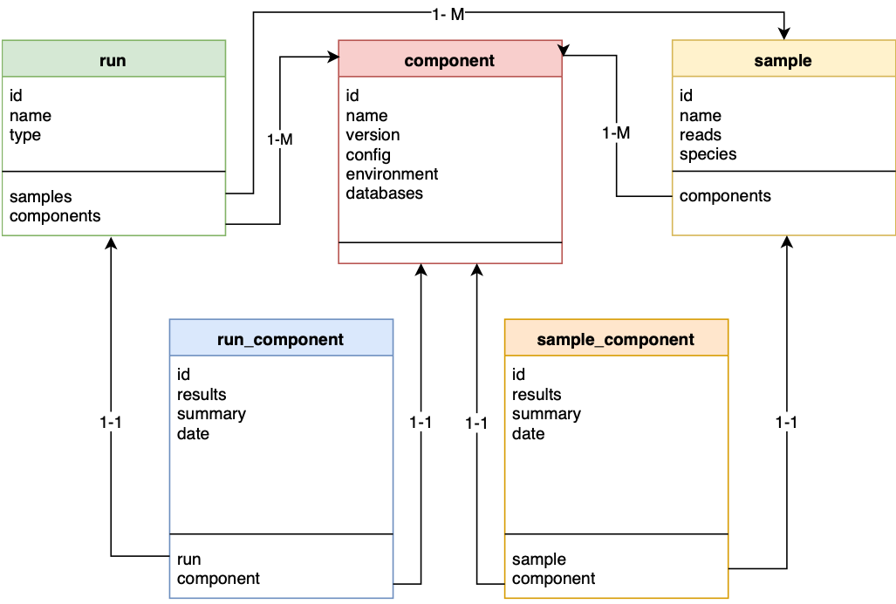

# Structure
## High Level Concepts

Bifrost is being developed with the concept that data analysis should be tracked downstream through the use of components. The idea is that summarized values are often used for downstream analysis and that we should encourage running standardized components on samples or collections of samples. This serves the purpose of both centralizing the results and encouraging the use of standard tools for analysis. The first components for bifrost have all been developed based on quality control of bacterial WGS samples. If the resulting data is standardized then visual analysis tools can be built on top of the summarized data and pool information from all samples that have also run the same component and additional metrics can be discovered more easilly off the pooled datasets.

## Background

Bifrost is a platform whose philosophy is to impose structure on data analysis, so it is unsurprising that organizing the structure of the underlying data on your server is important to how bifrost optimally functions. The following is what we recommend for setting up bifrost. As background our structure is used at Statens Serum Institut which now handles >10,000 bacterial WGS samples per year.


## File structure

### Setting up the structure

For bifrost to manage data properly it will want to have each of the code, input and output in it's own location. For example given our starting directory post install of:

```
$ pwd
/path/to/bifrost/
$ ls -1
bifrost_resources
bifrost
```
we'd want to
```
$ mkdir input;
$ mkdir output;
```
Additional structure within the input and output could also prove useful. As an example we have some structure here with extra year folder and showing a run with 2 samples within it waiting to be ran:
```
/path/to/bifrost/
├── bifrost
│   └── resources -> /path/to/bifrost/bifrost_resources (symlink)
├── bifrost_resources
├── input
│   └── 2019
│       └── 190525_Run1
│           ├──Sample1_R1.fastq.gz
│           ├──Sample1_R2.fastq.gz
│           ├──Sample2_R1.fastq.gz
│           └──Sample2_R2.fastq.gz
└── output
    └── 2019
```
**Note** The foders for the runs or the data can be symbolically linked as always so the structure does not have to conflict with existing storage solutions for data.

### Running bifrost in the file structure
To run bifrost in the structure you'll want to execute:
```
$ cd /path/to/bifrost/
$ mkdir -p output/2019/190525_Run1
$ cd output/2019/190525_Run1
$ cp -r /path/to/bifrost/bifrost src
$ ln -s /path/to/bifrost/input/2019/190525_Run1 samples
$ cp /path/to/bifrost/input/2019/190525_Run1/run_metadata.xlsx run_metadata.xlsx
$ conda activate bifrost
$ snakemake -s src/bifrost.smk
```
Which will generate an output with the following structure:
```
/path/to/bifrost/
├── bifrost
│   ├── resources -> /path/to/bifrost/bifrost_resources (symlink)
│   ├── config.yaml
│   └── <other source files>
├── bifrost_resources
│   └── <location or links to component resources>
├── input
│   └── 2019 
│       └── 190525_Run1
│           ├──run_metadata.xlsx
│           ├──Sample1_R1.fastq.gz
│           ├──Sample1_R2.fastq.gz
│           ├──Sample2_R1.fastq.gz
│           └──Sample2_R2.fastq.gz
└── output
    └── 2019
        └── 190525_Run1
            ├──src (cp of /path/to/bifrost/bifrost)
            ├──samples -> /path/to/bifrost/input/2019/190525_Run1 (symlink)
            ├──run_metadata.xlsx
            ├──Sample1
            ├──Sample2
            └──<other run files>
```
Keep this location locked down as changes in the input and output folder not made by bifrost will not be tracked properly in the bifrost database. As the database tracks where output is and where input is this structure allows you to be able to re-run or update components in a structured manner.

## Database Structure

At it's core bifrost is heavilly influenced by it's DB structure. The DB revolves around the relationship of 5 Collections:


Collection | Short Description| Long Description
--- | --- | ---
**sample** | sample | This is the smallest unit for processing data on the system which contain information pertanent for use or can generate the data via components run on the sample.
**component** | pipeline | A component can be thought of as a pipeline which manipulates a sample or run to some other form of output, this is typically a software pipeline but can also by something that runs exclusively on the database. Components should be versioned for the purpose of reproducability and compatability.
**sample_component** | result of pipeline on sample | When a sample is run against a single component the result is stored in a sample_component, running a sample on two different components thus stores results in 2 different sample_component entries.
**run** | samples | A run is a collection of samples, organized within a set for both run_components and management of data
**run_component** | result of pipeline on samples | When a run is manipulated by a component the resulting output is stored in a run_component. This differs from a sample component in that results should be specific to the collection of samples included and not to the individual samples themselves. (Currently not implemented)